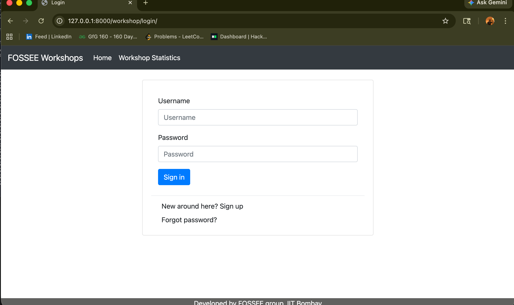
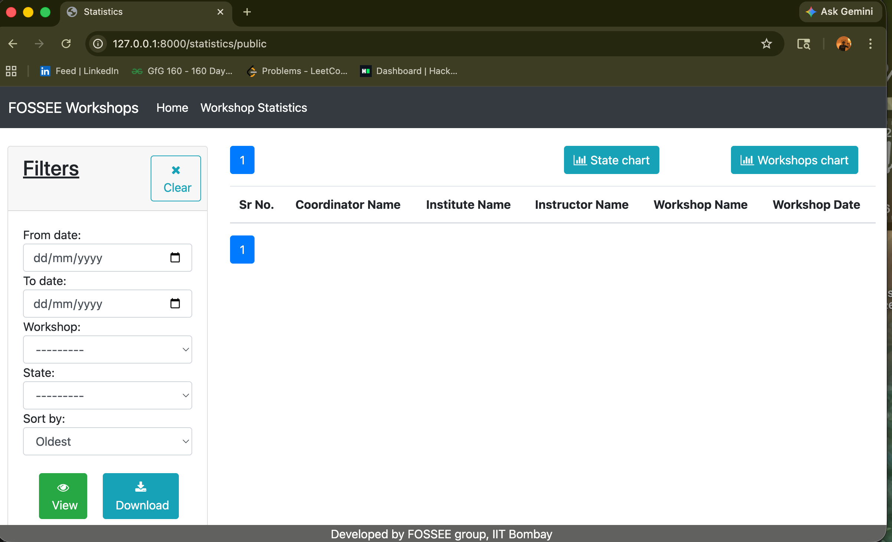
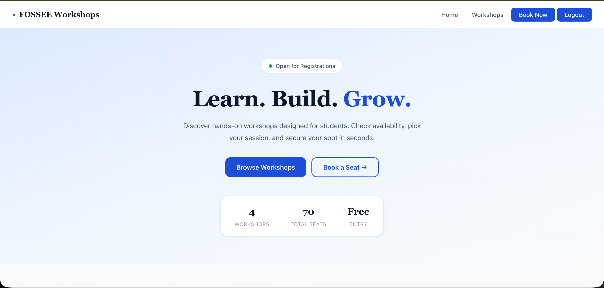
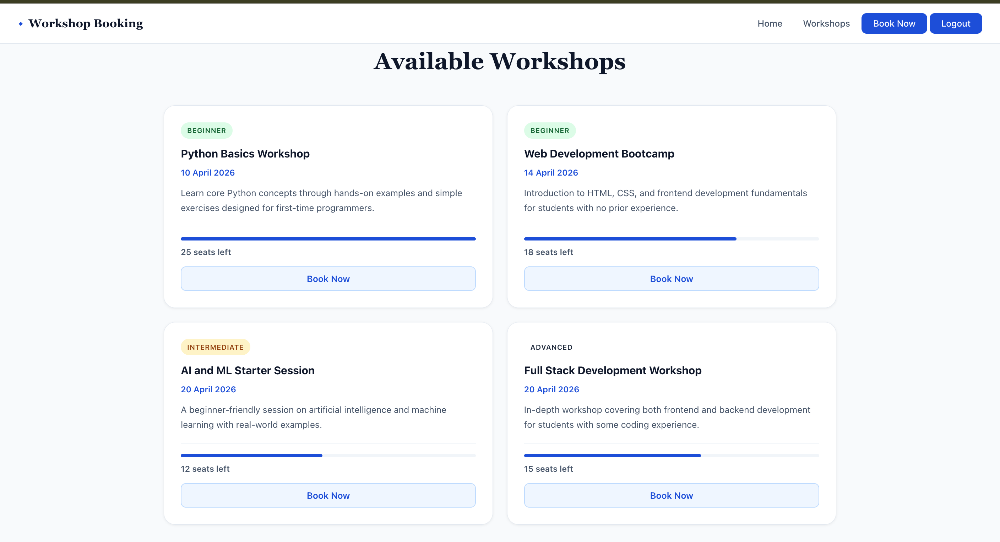
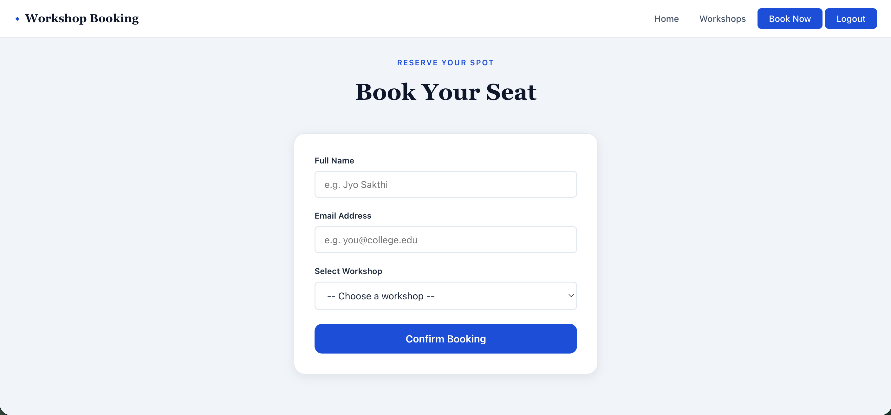
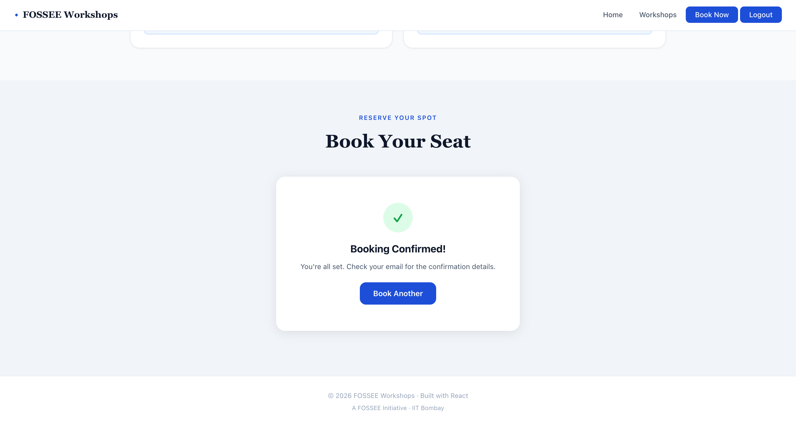
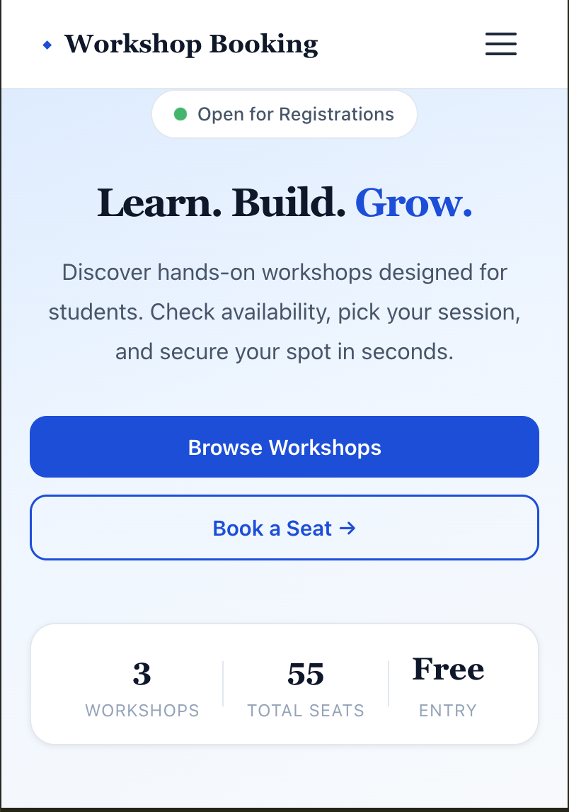
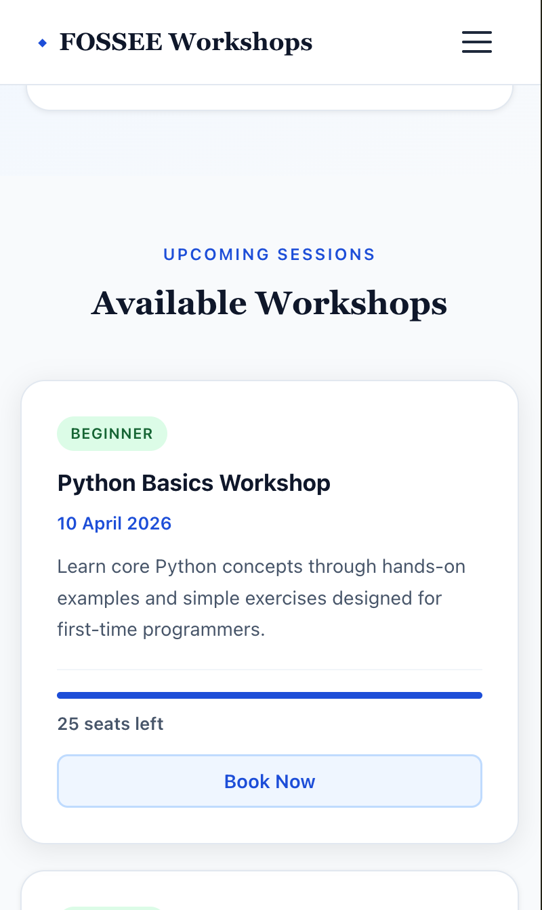
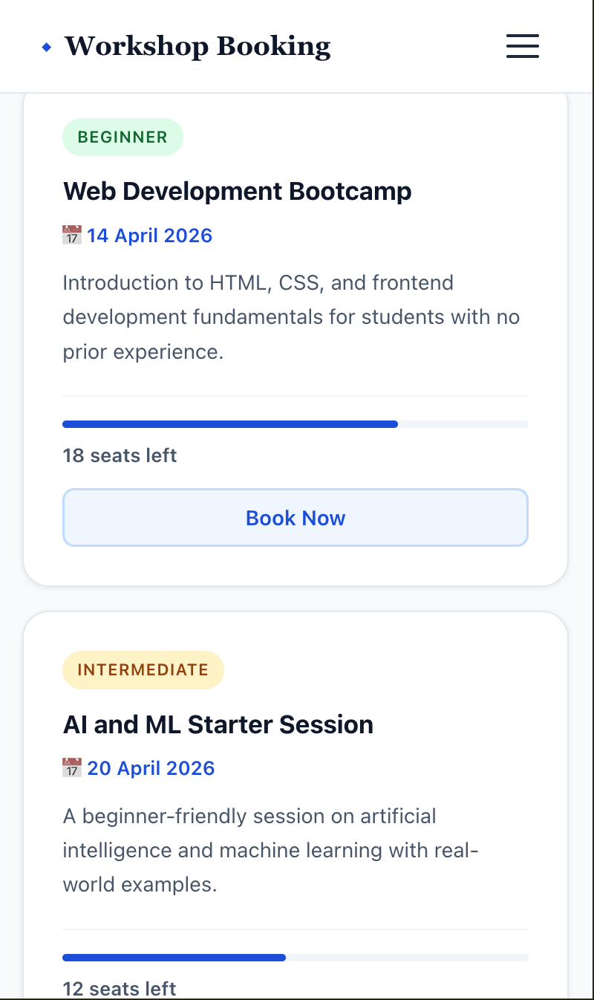
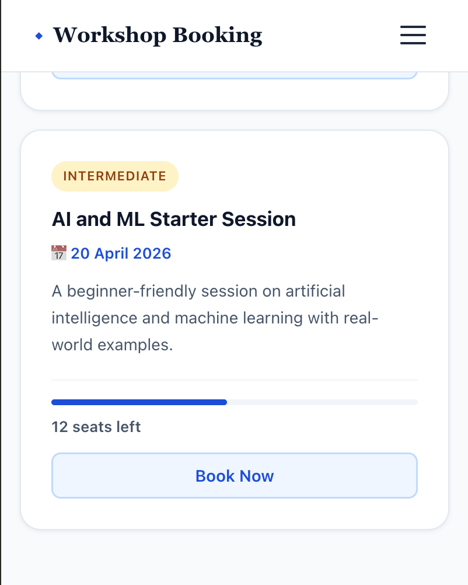

# Workshop Booking — UI Redesign

A mobile-first React redesign of the [FOSSEE Workshop Booking](https://github.com/FOSSEE/workshop_booking) system.

By Jyotish N of VIT Chennai studying B.Tech CSE AI AND ML. The below project is for the FOSSEE Python Screening Task.
---

## Table of Contents

- [Getting Started](#getting-started)
- [What Changed](#what-changed)
- [Design Principles](#design-principles)
- [Responsiveness](#responsiveness)
- [Performance & Trade-offs](#performance--trade-offs)
- [Accessibility & SEO](#accessibility--seo)
- [Challenges](#challenges)
- [Tech Stack](#tech-stack)
- [Before & After](#before--after)

---

## Getting started 

> Requires Node.js v16 or above

Cloning the Repository

To get a local copy of this project, run the following commands in your terminal:

```bash
git clone https://github.com/Jyo-08/workshop-ui-redesign-fossee.git
cd workshop-ui-redesign-fossee
npm install
npm start
```

Open [http://localhost:3000](http://localhost:3000) in your browser.

---

## What Changed

The original site was plain and did not work well on phones. Here is what I improved:

- **Workshop Cards** — Workshops are shown as cards so users can scan them quickly.
- **Hero Section** — A welcome section at the top helps users understand the site right away.
- **Seat Availability Bars** — A visual bar shows how many seats are left, which is easier to read than a plain number.
- **Booking Form** — Fields are grouped clearly with proper labels, making it less confusing to fill out.
- **Expanded Workshop List** — Added more diverse workshops like Full Stack Development to better represent real-world student interests.
- **Navigation** — Cleaner nav links with smooth scrolling between sections.
- **Spacing & Typography** — Better font sizes and spacing so text is easier to read on small screens.

---

## Design Principles

**Keep it simple.** Most users are students who may be visiting for the first time. Everything should be easy to understand without any explanation.

**Mobile first.** I built the layout for small screens first, then adjusted it for larger ones. This made sure the phone experience was always the priority.

**Stay lightweight.** I did not use any heavy libraries or add extra animations. This keeps the app fast, especially on slower mobile connections.

---

## Responsiveness

- Used **Flexbox** so cards stack into one column on phones and expand on wider screens.
- Font sizes and spacing use `rem` units so they adjust based on the user's settings.
- Buttons and inputs are at least 44px tall so they are easy to tap on a touchscreen.
- Added breakpoints at `480px`, `768px`, and `1024px` to handle phones, tablets, and desktops.

---

## Performance & Trade-offs

**No animations.** Animations look nice but can slow things down on mid-range phones. I skipped them to keep the experience smooth for everyone.

**No UI library.** I wrote all styles in plain CSS instead of using something like Material UI. This keeps the bundle size small and the code easy to follow.

**Mock data only.** The app uses hardcoded data instead of connecting to the Django backend. Connecting to the real API was outside the scope of this task.

---

## Accessibility & SEO

**Accessibility:**
- Used proper HTML tags like `<main>`, `<nav>`, and `<section>` instead of plain `<div>` tags everywhere.
- All images have `alt` text.
- Form inputs have matching `<label>` tags so screen readers can read them correctly.
- Text colour contrast meets WCAG 2.1 AA standards (at least 4.5:1 ratio).
- All buttons and links work with keyboard navigation.

**SEO:**
- Added a `<title>` and `<meta name="description">` in `index.html`.
- Headings follow a proper order (`h1` → `h2` → `h3`) so search engines can understand the page structure.
- `<meta name="viewport">` is set correctly for mobile search indexing.

---

## Challenges

The hardest part was taking the original flat layout and breaking it into separate React components without breaking anything. The old code had no separation — everything was in one place — so I had to carefully split it into pieces like `NavBar`, `WorkshopCard`, and `BookingForm`.

It was also tricky to decide what to add and what to leave out. I kept reminding myself that clarity and speed matter more than adding extra visual effects.

---

## Tech Stack

| Tool | Purpose |
|---|---|
| React 19 | Building the UI |
| React Router DOM 7 | Moving between pages |
| Plain CSS | All styling |
| Create React App | Project setup and build |

---

## Before & After

### Before — Original Django Version

| Login Page | Statistics Page |
|---|---|
|  |  |

### After — Desktop

| Hero Section | Workshop Cards | Booking Form | Booked and email verification|
|---|---|---|---|
|  |  |  | 

### After — Mobile

| Hero | Workshops | WebDev and AIML | Full-Stack | Booking |
|---|---|---|---|---|
|  |  |  |  |  |
---

## Notes

This is a frontend-only redesign. The Django backend has not been changed. The React app can be connected to the existing API endpoints with some configuration.
