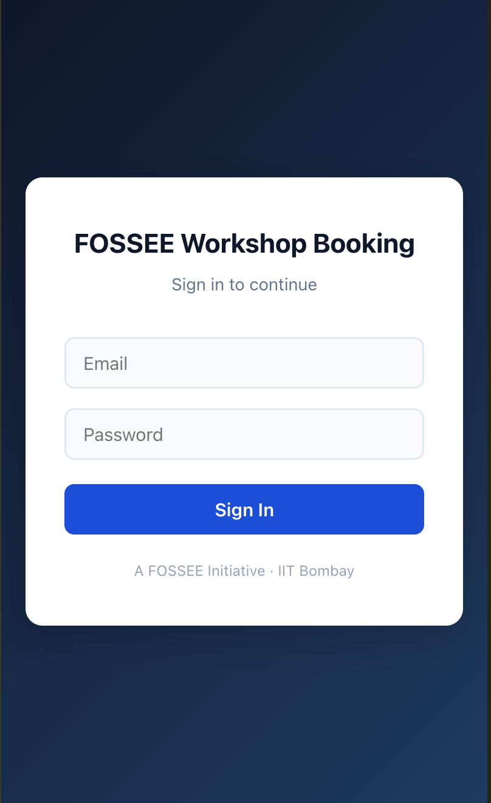
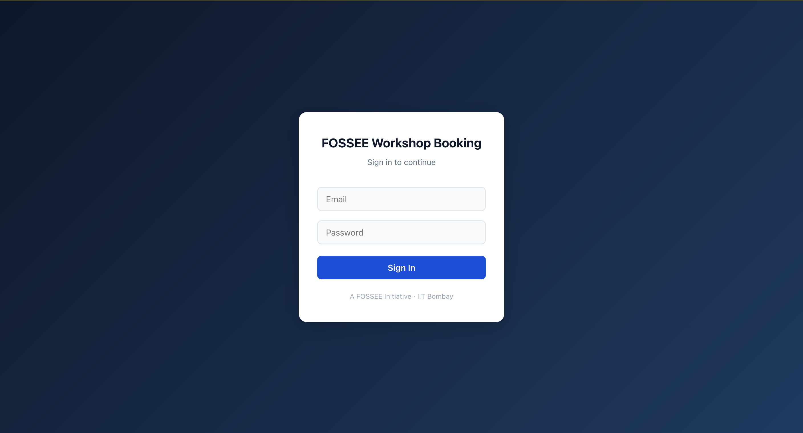
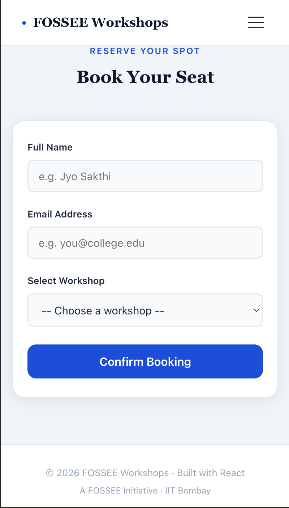

# Workshop Booking — UI Redesign

Hi, I am **Jyotish N**.
This is a project for the python screening task of FOSSEE summer fellowship by IIT Bombay.
The project is to redesign the given UI to a new one using react. I mainly focused on clarity, responsiveness and navigation of the user interface while preserving its original functionality. 

A mobile-first React redesign of the [FOSSEE Workshop Booking](https://github.com/FOSSEE/workshop_booking) system.

---

## Table of Contents

- [Problem Statement](#problem-statement)
- [Solution Approach](#solution-approach)
- [Key Features](#key-features)
- [Getting Started](#getting-started)
- [What Changed](#what-changed)
- [Design Principles](#design-principles)
- [Responsiveness](#responsiveness)
- [Performance & Trade-offs](#performance--trade-offs)
- [Accessibility & SEO](#accessibility--seo)
- [Challenges](#challenges)
- [Tech Stack](#tech-stack)
- [Learning Outcomes](#learning-outcomes)
- [Before & After](#before--after)
- [Conclusion](#conclusion)
- [Notes](#notes)

---

## Problem Statement

The existing FOSSEE Workshop Booking platform was built using Django with minimal frontend styling. While it was functional, it lacked a modern user interface, had poor readability on mobile devices, and did not provide a smooth user experience for students trying to browse and book workshops.

---

## Solution Approach

I approached this as a frontend-only redesign using React. Instead of modifying the backend, I focused on rebuilding the UI layer to be cleaner, faster, and more accessible.

The key decisions were:
- Switching to a card-based layout so workshops are easier to scan
- Building mobile-first so the most common use case (students on phones) works best
- Keeping the code simple and dependency-light so it stays maintainable
- Adding visual cues like seat availability bars and difficulty tags to help users make decisions faster

---

## Key Features

- **Login Page** — Clean sign-in screen with a dark gradient background
- **Hero Section** — Welcome banner with quick stats (workshops, seats, entry type)
- **Workshop Cards** — Each workshop shows its difficulty, date, description, and seat availability
- **Seat Availability Bar** — Visual progress bar showing remaining seats at a glance
- **Difficulty Tags** — Color coded tags (Beginner, Intermediate, Advanced) for quick filtering
- **Booking Form** — Simple form with name, email, and workshop selection with validation
- **Booking Confirmation** — Success popup confirming the booking and next steps
- **Responsive Navigation** — Hamburger menu on mobile, full nav on desktop

---
## UX Thinking

Before writing any code, I thought about who would actually use this platform and what they needed.

**Who is the user?** Mostly college students, many of them on their phones, trying to quickly find and register for a free workshop. They are not tech-savvy power users — they just want to get in, find something useful, and book it without confusion.

**What were the pain points in the original design?**
- The layout had no visual hierarchy — everything looked the same importance
- There was no way to quickly see how many seats were left
- The login page felt plain and gave no sense of what the platform was about
- On mobile, the site was hard to navigate and buttons were too small to tap comfortably

**How I addressed them:**
- Cards give each workshop its own space so users can scan quickly instead of reading line by line
- The seat availability bar gives an instant visual answer to "is there still space?"
- Difficulty tags (Beginner, Intermediate, Advanced) help students self-filter without reading the full description
- The hero section tells users what the platform is about the moment they land on it
- The booking confirmation popup gives immediate feedback so users know their action worked

The goal was to make every interaction feel obvious. If a user has to stop and think about what to do next, the design has already failed.

---

## Getting Started 

> Requires Node.js v16 or above

Cloning the Repository

To get a local copy of this project, run the following commands in your terminal:

```bash
git clone https://github.com/Jyo-08/workshop-ui-redesign-fossee.git
cd workshop-ui-redesign-fossee
npm install
npm start
```

Open [http://localhost:3000](http://localhost:3000) in your browser.

---

## What Changed

The original site was plain and did not work well on phones. Here is what I improved:

- **Workshop Cards** — Workshops are shown as cards so users can scan them quickly.
- **Hero Section** — A welcome section at the top helps users understand the site right away.
- **Seat Availability Bars** — A visual bar shows how many seats are left, which is easier to read than a plain number.
- **Booking Form** — Fields are grouped clearly with proper labels, making it less confusing to fill out.
- **Expanded Workshop List** — Added more diverse workshops like Full Stack Development to better represent real-world student interests.
- **Booking Confirmation Popup** — Informs users that their workshop booking was successful and that they will receive further details via email.
- **Navigation** — Cleaner nav links with smooth scrolling between sections.
- **Spacing & Typography** — Better font sizes and spacing so text is easier to read on small screens.

---

## Design Principles

**Keep it simple.** Most users are students who may be visiting for the first time. Everything should be easy to understand without any explanation.

**Mobile first.** I built the layout for small screens first, then adjusted it for larger ones. This made sure the phone experience was always the priority.

**Stay lightweight.** I did not use any heavy libraries or add extra animations. This keeps the app fast, especially on slower mobile connections.

---

## Responsiveness

- Used **Flexbox** so cards stack into one column on phones and expand on wider screens.
- Font sizes and spacing use `rem` units so they adjust based on the user's settings.
- Buttons and inputs are at least 44px tall so they are easy to tap on a touchscreen.
- Added breakpoints at `480px`, `768px`, and `1024px` to handle phones, tablets, and desktops.

---

## Performance & Trade-offs

**No animations.** Animations look nice but can slow things down on mid-range phones. I skipped them to keep the experience smooth for everyone.

**No UI library.** I wrote all styles in plain CSS instead of using something like Material UI. This keeps the bundle size small and the code easy to follow.

**Mock data only.** The app uses hardcoded data instead of connecting to the Django backend. Connecting to the real API was outside the scope of this task.

---

## Accessibility & SEO

**Accessibility:**
- Used proper HTML tags like `<main>`, `<nav>`, and `<section>` instead of plain `<div>` tags everywhere.
- All images have `alt` text.
- Form inputs have matching `<label>` tags so screen readers can read them correctly.
- Text colour contrast meets WCAG 2.1 AA standards (at least 4.5:1 ratio).
- All buttons and links work with keyboard navigation.

**SEO:**
- Added a `<title>` and `<meta name="description">` in `index.html`.
- Headings follow a proper order (`h1` → `h2` → `h3`) so search engines can understand the page structure.
- `<meta name="viewport">` is set correctly for mobile search indexing.

---

## Challenges

The hardest part was structuring the original flat layout into something clean and organized without breaking the existing functionality. I kept everything in App.js to stay focused on the UI improvements rather than over-engineering the component structure.

It was also tricky to decide what to add and what to leave out. I kept reminding myself that clarity and speed matter more than adding extra visual effects.

---

## Tech Stack

| Tool | Purpose |
|---|---|
| React 19 | Building the UI |
| React Router DOM 7 | Moving between pages |
| Plain CSS | All styling |
| Create React App | Project setup and build |

---
## Learning Outcomes

Building this project taught me a lot beyond just writing code:
- How to think about mobile users first before desktop
- Why accessibility matters and how small things like `aria-label` make a big difference
- How to balance visual design with performance — not everything that looks nice is worth adding
- How to use git properly with meaningful commit messages to document progress

---

## Before & After

### Before 

| Login Page | Statistics Page |
|---|---|
|  |  |

### After — Login Page

| Mobile | Desktop |
|---|---|
|  |  |

### After — Desktop 

| Hero Section | Workshop Cards |
|---|---|
|  |  |

| Booking Form | Booking Confirmed |
|---|---|
|  |  |

### After — Mobile 

| Hero | Workshops | More Workshops |
|---|---|---|
|  |  |  |

| Advanced Workshop | Booking Form | Booking Confirmed |
|---|---|---|
|  |  |  |

## Conclusion

This project was not just for the screening task, I learnt more about UI and UX designing which helped me a lot.
In this project, I completely focused on increasing the clarity, responsiveness and navigation of the UI. 
The design was kept simple and heavy UI was not used which makes the website user friendly. 
In the end, I had a very great experience in doing this screening task.

## Notes

This is a frontend-only redesign. The Django backend has not been changed. The React app can be connected to the existing API endpoints with some configuration.

---

Designed and Developed by **Jyotish N**
VIT Chennai — B.Tech CSE (AI/ML), First Year


